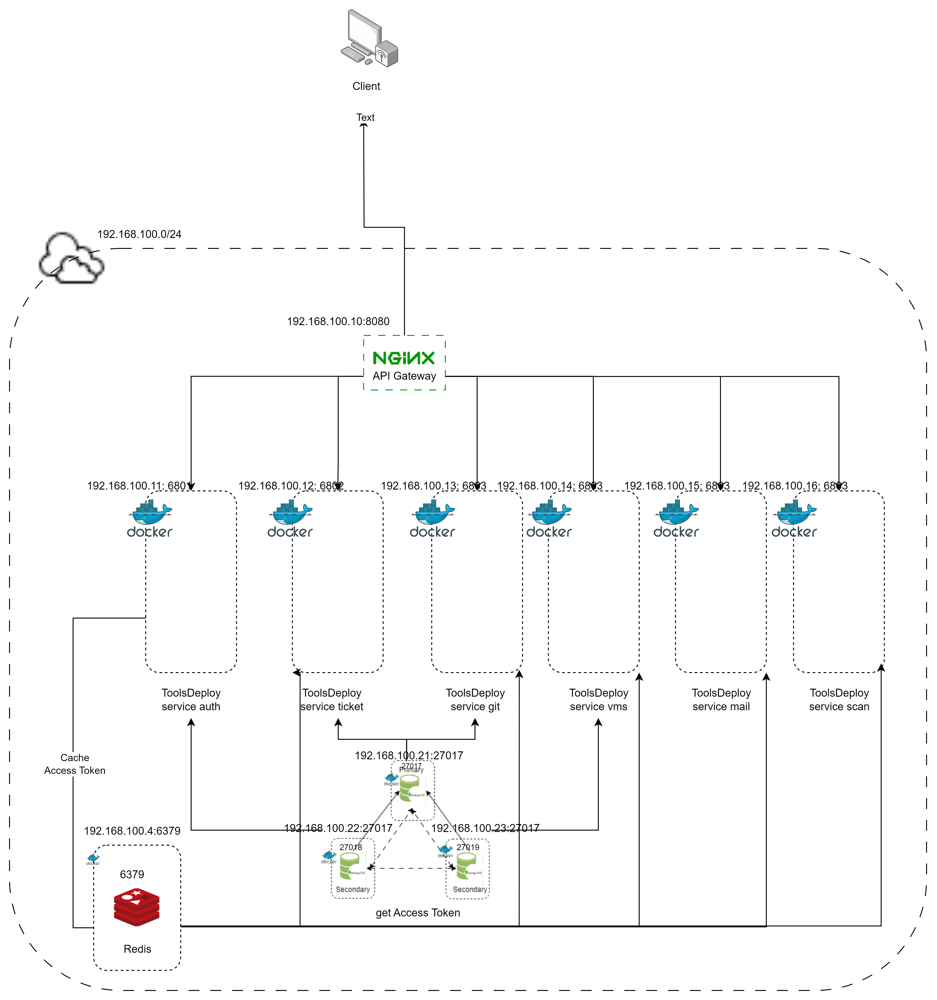

# BE-ToolsDeploy

Đây là mã nguồn code hệ thống Back-end, được thiết kế theo kiến trức microservices, kiển trúc thư mục theo monoreppo, sử dụng ngôn ngữ Typescrit, sử dụng pnpm để quản lí package.

## Installation

### Window/Ubuntu

Sử dụng Nodejs 18 and Typescript ^5.1.3
Clone the project

```bash
  git clone https://link-to-project
```

Go to the project directory

```bash
  cd my-project
```

Install dependencies

```bash
  npm install
  npm i pnpm
  pnpm i
```

Build

```bash
  // build all microservice
  pnpm Build
  // build a microservice
  pnpm --filter name-service build
```

Start the server

```bash
  // start all micriservice
  pnpm --parallel start:dev
  // start a micriservice
  pnpm --filter  name-microsrvice start:dev
```

Eslint code

```bash
  // lint all micriservice
  pnpm lint
  // start a micriservice
  pnpm --filter  name-microsrvice lint
```

Install lib/dependencie

```bash
pnpm --filter name-service install name-lib/dependencie
```

### Docker

[Dockerfile](https://github.com/quangh0409/BE-ToolsDeploy/blob/main/Dockerfile)
[docker-compose.yaml](https://github.com/quangh0409/BE-ToolsDeploy/blob/main/docker-compose.yaml)

```bash
cd BE-ToolsDeploy
// build iamges
docker-compose build
// run all
docker-compose up -d
// run all and build
docker-compose up --build -d
// run a service
docker-compose up name-service -d
```

### Back-end Architecture

BE-ToolsDeploy được thiết kế với 6 microservices, 3 cluser mongodb (theo mô hình replica set 1 primary, 2 secondary), 1 Nginx (Api gateway)

Tất cả được đều được chạy với docker với mạng subnet 192.168.100.0/24



## Contact
<a href="https://github.com/quangh0409" style="display: flex; align-items: center; text-decoration: none;">
  
  <p style="color: black; margin: 0 0 0 10px;">Vũ Trọng Quảng</p>
</a>
<a href="#be-toolsdeploy" style="display: flex; align-items: center; text-decoration: none;">
  
  <p style="color: black; margin: 0 0 0 10px;">trongquangvu80@gmail.com</p>
</a>
<a href="#be-toolsdeploy" style="display: flex; align-items: center; text-decoration: none;">
  
  <p style="color: black; margin: 0 0 0 10px;">Vũ Trọng Quảng</p>
</a>